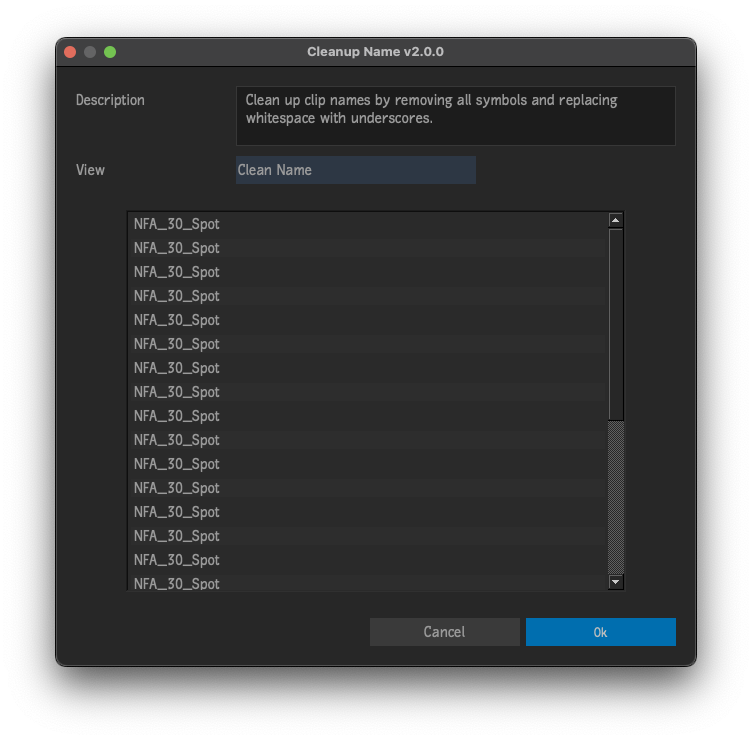

# Cleanup Name

Plugin for [Autodesk Flame software](http://www.autodesk.com/products/flame).

Cleanup clip names by removing all symbols and changing whitespace to underscores.

## Compatibility
|Script Version|Flame Version|
|---|---|
|v2.X.X|Flame 2025 and newer|
|v1.X.X|Flame 2022 up to 2024.2|
|v0.X.X|Flame 2021 up to 2021.2|

## Installation

### Flame 2025 and newer
To make available to all users on the workstation, copy `cleanup_name.py` to `/opt/Autodesk/shared/python`

For specific users, copy `cleanup_name.py` to the appropriate path below...
|Platform|Path|
|---|---|
|Linux|`/home/<user_name>/flame/python`|
|Mac|`/Users/<user_name>/Library/Preferences/Autodesk/flame/python`|

### Flame 2021 up to 2024.2
To make available to all users on the workstation, copy `cleanup_name.py` to `/opt/Autodesk/shared/python`

For specific users, copy `cleanup_name.py` to `/opt/Autodesk/user/<user name>/python`

### Last Step
Finally, inside of Flame, go to Flame (fish) menu `->` Python `->` Rescan Python Hooks

## Menus
 - Right-click selected clips on the Desktop `->` Edit... `->` Cleanup Name
 - Right-click selected clips in the Media Panel `->` Edit... `->` Cleanup Name

## Acknowledgments
UI Templates from [Logik-Portal/qt-snippets](https://github.com/logik-portal/qt_snippets)
